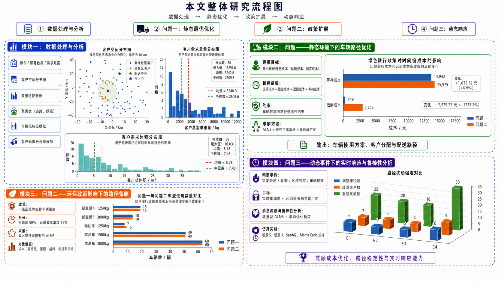

# 2026 华中杯数学建模：城市绿色物流配送调度优化

<p align="center">
  
  
  
  
</p>

## 项目概述

本项目为 **2026 华中杯数学建模竞赛** 相关代码与结果整理，研究主题为 **城市绿色物流配送调度优化**。

项目围绕车辆路径规划问题展开，在传统 VRP 模型基础上，进一步考虑：

- 异质车队；
- 载重与容积双容量约束；
- 软时间窗约束；
- 时变交通速度；
- 绿色配送区限行政策；
- 动态订单扰动响应。

整体建模思路由浅入深，依次完成 **静态配送优化、绿色限行约束优化、动态订单事件响应** 三个问题的求解。项目使用 Python 完成数据读取、任务拆分、路径构造、成本评估、启发式搜索、结果统计与可视化输出。

---

## 摘要流程图

> 将流程图图片放在 `figures/paper/liuchengtu0.png` 后，GitHub 会自动显示。

<p align="center">
  
</p>

---

## 问题设置

| 问题 | 研究场景 | 核心任务 | 主要方法 |
|---|---|---|---|
| 问题一 | 无绿色限行的静态配送调度 | 在满足容量、时间窗等约束的基础上，最小化综合配送成本 | ALNS 多随机种子搜索 |
| 问题二 | 绿色配送区限行下的车辆调度 | 考虑 8:00--16:00 燃油车禁入绿色区后的路径重规划 | 嵌入限行约束的改进 ALNS |
| 问题三 | 动态订单扰动响应 | 面对订单取消、新增、地址变更和时间窗收紧等事件，进行局部路径修复 | 状态冻结 + LNS--VNS 局部重优化 |

---

## 项目亮点

### 1. 统一的绿色物流调度建模框架

三个问题共用任务集合、车辆集合、成本口径与约束体系，便于比较不同政策和动态事件对配送方案的影响。

### 2. 综合成本函数设计

成本函数综合考虑：

- 固定车辆使用成本；
- 行驶能耗成本；
- 碳排放成本；
- 等待成本；
- 迟到惩罚成本。

相比只考虑路径距离的传统 VRP，本项目更贴近实际城市配送场景。

### 3. 绿色配送区限行约束建模

问题二显式加入绿色配送区政策：

- 新能源车辆可在任意时间进入绿色配送区；
- 燃油车在 8:00--16:00 期间不得进入绿色配送区；
- 在路径构造、插入评价和结果检查阶段均进行限行可行性验证。

### 4. 动态扰动响应机制

问题三针对实际配送过程中的订单扰动，设计局部重优化策略：

- 冻结已执行或正在执行的路径；
- 更新受影响订单集合；
- 提取局部子问题；
- 使用 LNS--VNS 修复路径；
- 在降低剩余成本的同时控制路径改动幅度。

### 5. 完整工程化整理

项目包含完整的：

- Python 源代码；
- 快速运行脚本；
- 结果文件；
- 可视化图表；
- LaTeX 论文源文件；
- 项目结构说明文档。

---

## 核心结果

### 问题一与问题二对比

| 指标 | 问题一：静态调度 | 问题二：绿色限行 | 变化 |
|---|---:|---:|---:|
| 启用车辆数 | 140 | 141 | +1 |
| 总配送距离 | 18537.97 km | 18632.96 km | +94.98 km |
| 总配送成本 | 115512.59 元 | 120037.28 元 | +4524.70 元 |
| 等待成本 | 14942.76 元 | 15975.28 元 | +1032.52 元 |
| 迟到成本 | 148.58 元 | 2723.80 元 | +2575.23 元 |
| 估算碳排放量 | 12146.42 kg | 12292.33 kg | +145.91 kg |

从结果可以看出，绿色配送区限行政策会增加车辆调度难度。相比问题一，问题二在总配送距离、车辆使用数量、等待成本和迟到成本上均有所上升，其中迟到成本增加较为明显，说明限行约束会压缩燃油车的可行服务时间，从而影响整体时序安排。

### 问题三动态响应结果

问题三针对以下四类动态事件进行局部重优化：

- 订单取消；
- 新增订单；
- 客户地址变更；
- 时间窗收紧。

局部重优化后，系统能够在不大规模改变原有路径的前提下，降低剩余运营成本，说明该动态响应策略在 **成本优化** 与 **路径稳定性** 之间取得了较好的平衡。

---

## 目录结构

```text
green_logistics_vrp_optimized/
├── src/                         # Python 源代码
│   ├── main_p1.py                # 问题一：静态调度入口
│   ├── main_p2.py                # 问题二：绿色限行入口
│   ├── main_p3.py                # 问题三：动态响应入口
│   ├── main_init.py              # 初始方案生成入口
│   ├── main_plot.py              # 基础数据可视化入口
│   ├── alns_p1.py                # ALNS 核心算法
│   ├── config.py                 # 全局参数配置
│   ├── cost.py                   # 成本计算模块
│   ├── data_loader.py            # 数据读取与预处理
│   ├── initial_solution.py       # 初始解构造
│   ├── route_eval.py             # 路径评价模块
│   ├── route_merge.py            # 路径合并模块
│   ├── task_eval.py              # 任务评价模块
│   ├── plot_data.py              # 基础数据图表
│   ├── plot_p1_results.py        # 问题一结果图表
│   └── plot_p2_results.py        # 问题二结果图表
│
├── data/
│   ├── raw/                      # 原始 Excel 数据
│   └── processed/                # 中间处理数据
│
├── results/
│   ├── problem1/                 # 问题一结果
│   ├── problem2/                 # 问题二结果与日志
│   └── problem3/                 # 问题三结果
│
├── figures/
│   ├── paper/                    # 论文与 README 使用图片
│   ├── problem1/                 # 问题一可视化图表
│   ├── problem2/                 # 问题二可视化图表
│   └── problem3/                 # 问题三可视化图表
│
├── paper/
│   └── main.tex                  # LaTeX 论文源文件
│
├── scripts/                      # Windows 快速运行脚本
├── docs/                         # 项目说明文档
├── requirements.txt              # Python 依赖
└── README.md
```

---

## 环境配置

建议使用 Python 3.9 及以上版本。

### 1. 克隆项目

```bash
git clone git@github.com:你的用户名/你的仓库名.git
cd 你的仓库名
```

### 2. 安装依赖

```bash
pip install -r requirements.txt
```

主要依赖包括：

```text
pandas
numpy
matplotlib
openpyxl
```

---

## 数据准备

请将原始 Excel 数据文件放入 `data/raw/` 目录。

建议文件结构如下：

```text
data/raw/
├── 订单信息.xlsx
├── 距离矩阵.xlsx
├── 客户坐标信息.xlsx
└── 时间窗.xlsx
```

如果原始数据文件名不同，需要同步修改 `src/data_loader.py` 或相关入口脚本中的文件读取路径。

---

## 运行方式

### 运行问题一

```bash
python src/main_p1.py
```

### 运行问题二

```bash
python src/main_p2.py
```

### 运行问题三

```bash
python src/main_p3.py
```

---

## Windows 快速运行

如果使用 Windows，可以直接运行 `scripts/` 目录下的批处理脚本：

```text
scripts/
├── run_problem1.bat
├── run_problem2.bat
├── run_problem3.bat
├── plot_problem1.bat
├── plot_problem2.bat
└── plot_data.bat
```

---

## 图表生成

### 生成基础数据图表

```bash
python src/main_plot.py
```

### 生成问题一结果图表

```bash
python src/plot_p1_results.py
```

### 生成问题二结果图表

```bash
python src/plot_p2_results.py
```

图表默认输出到：

```text
figures/problem1/
figures/problem2/
figures/problem3/
figures/paper/
```

---

## 结果文件说明

| 文件路径 | 内容说明 |
|---|---|
| `results/problem1/problem1_summary.csv` | 问题一最终方案汇总 |
| `results/problem1/problem1_routes.csv` | 问题一路径明细 |
| `results/problem1/problem1_multiseed_summary.csv` | 问题一多随机种子结果 |
| `results/problem2/problem2_summary.csv` | 问题二最终方案汇总 |
| `results/problem2/problem2_compare_with_p1.csv` | 问题一与问题二结果对比 |
| `results/problem2/problem2_policy_check.csv` | 绿色限行约束检查结果 |
| `results/problem3/problem3_event_results.csv` | 动态事件优化结果 |
| `results/problem3/problem3_event_routes.csv` | 动态事件调整路径 |

---

## 方法说明

### 问题一：静态配送优化

问题一将配送任务建模为带有异质车队、双容量约束、软时间窗和时变速度的车辆路径优化问题。

求解流程如下：

1. 读取订单、车辆、距离矩阵和时间窗数据；
2. 构造满足容量约束的初始路径；
3. 使用破坏算子移除部分任务；
4. 使用修复算子重新插入任务；
5. 计算综合配送成本；
6. 使用模拟退火接受准则更新当前解；
7. 多随机种子重复搜索，选取最优可行方案。

### 问题二：绿色限行调度优化

问题二在问题一基础上加入绿色配送区限行约束。

核心规则为：

- 新能源车辆不受绿色配送区限行影响；
- 燃油车在 8:00--16:00 期间不得进入绿色配送区；
- 路径插入和路径评价阶段均需要检查限行可行性。

该问题重点分析绿色政策对车辆数量、配送距离、迟到成本和碳排放的影响。

### 问题三：动态订单扰动响应

问题三以问题二的配送方案为基准，考虑配送过程中发生的动态事件。

处理流程如下：

1. 识别事件类型；
2. 冻结已执行或正在执行路径；
3. 更新受影响任务集合；
4. 提取受影响路径和邻近路径；
5. 构造局部重优化子问题；
6. 使用 LNS--VNS 进行局部搜索；
7. 输出更新后的路径、成本变化和调整幅度。

---

## 可视化内容

项目生成的主要图表包括：

- 客户空间分布图；
- 配送任务时间窗分布图；
- 车辆路径成本分布图；
- 车辆类型使用情况图；
- 问题一与问题二成本对比图；
- 绿色限行政策影响分析图；
- 动态事件响应结果图。

图表文件可在以下目录查看：

```text
figures/problem1/
figures/problem2/
figures/problem3/
figures/paper/
```

---

## 论文文件

论文源文件位于：

```text
paper/main.tex
```

使用 XeLaTeX 编译：

```bash
xelatex paper/main.tex
```

---

## 后续改进方向

- 增加命令行参数，支持灵活选择问题编号、随机种子和迭代次数；
- 将数据读取、模型求解、结果分析和图表输出进一步解耦；
- 增加日志系统，自动记录每次运行的参数、时间和结果；
- 补充单元测试，验证成本计算、时间窗判断和限行约束检查；
- 增加更多动态事件组合场景，提高模型的实际应用能力；
- 将部分启发式搜索参数配置化，便于复现实验和调参。

---

## 适用场景

本项目适用于：

- 数学建模竞赛项目展示；
- 绿色物流路径优化问题研究；
- VRP 启发式算法学习；
- Python 建模工程结构参考；
- 课程设计、科研训练或竞赛代码整理。

---

## License

本项目主要用于数学建模竞赛、课程学习与项目展示。如需复用代码或结果，请注明来源。
